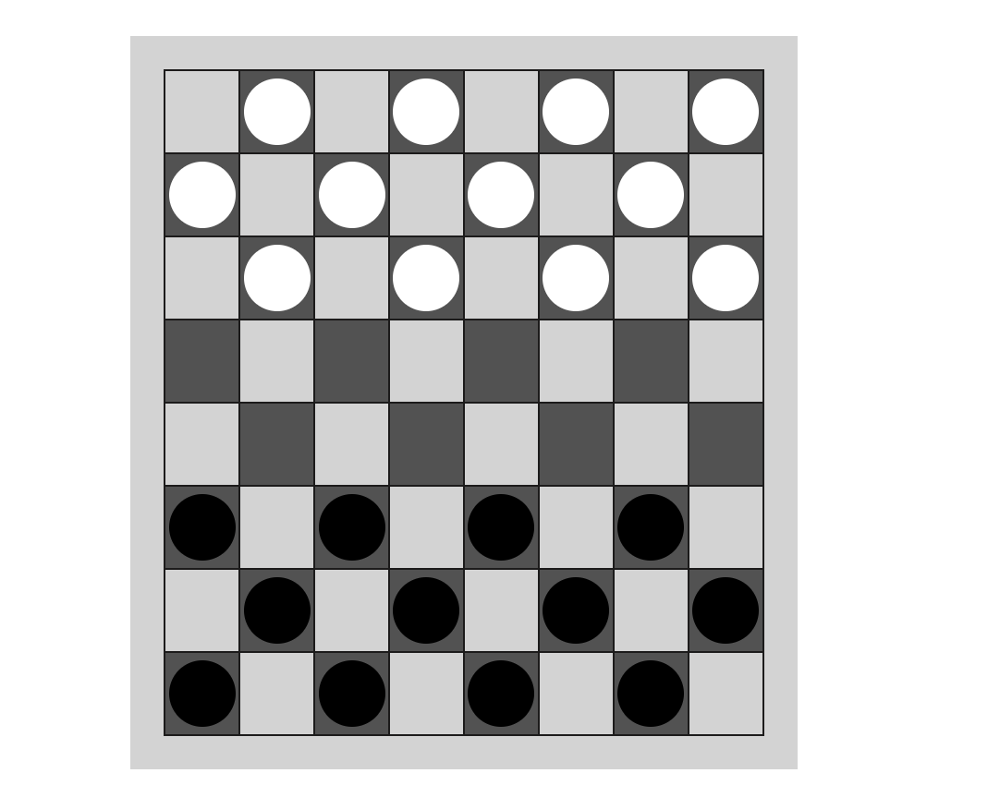

# Checkers Game

Link to the app: [checkers-game](https://eloquent-meerkat-846f76.netlify.app/):point_left: \
Link to my code overview: [code-overview](https://drive.google.com/drive/folders/1tebwAWbhXOqbhLWqo7rVBgRXDMgSyQe0?usp=sharing):point_left:

## About
The Checkers game was the final project of the Cyber4s's intensive pre course. \
The project was submmitted after 3 days of hard work and reviewed by course's instructors. \
The 40 students who have the most impresive projects were accepted to continue the full course. 

## What have I learnd ?
During the project, I have learnd a new approch of spliting the game's logic and the UI display. \
Before I programmed this project, I programmed javascript games while the game logic and UI display influnced each other directly. \
This behvior caused bugs and unwanted side effects. \
The project revealed me a different approach of programming games.
 
## Technologies:
- **[Javascript](https://www.javascript.com/)**
- **[css](https://www.npmjs.com/package/sass)**

## Main Feautres: ##
1. **Pawn's regular step** - Only one forward diagonal step is allowed.
2. **Pawns caupturing** - If there is many options the player can choose.
3. The player must caputre a pawn if he has a option.
4. **End game** - If the opponent hasn't any pawns you win.\
If any player can't move its a draw.

### Bonuses:
1. **Queen**- If Player's pawn can reach to the other side of the field, he will get a queen. \
The queen can move multipile steps backward and forward at once. 
2. **Multipile captures steps** - If there are more than one pawn the player can capture them by multiple steps. \
The all possible pawn's steps were calcaulted by dynamic programing recursive algorithm.

## Images:

   
 

